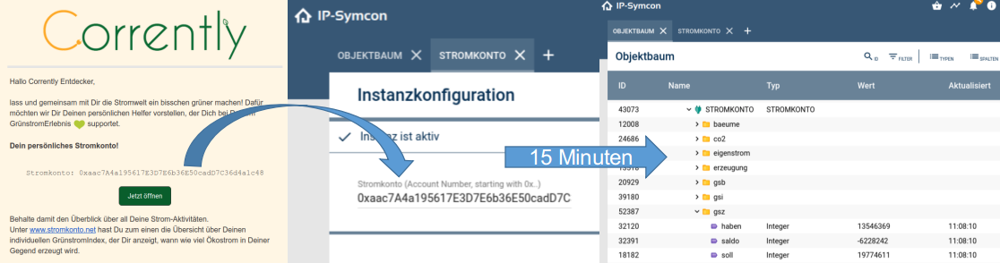

# STROMKONTO
Einbindung des Daten von einem Stromkonto über die [v2.0 REST API](https://corrently.io/). Die native Implementierung des Stromkontos, welche die selbe Schnittstelle nutzt ist unter [stromkonto.net](https://www.stromkonto.net/) zu finden. Das Anlegen und die Nutzung eines Stromkontos ist kostenlos.


### Inhaltsverzeichnis

1. [Funktionsumfang](#1-funktionsumfang)
2. [Voraussetzungen](#2-voraussetzungen)
3. [Software-Installation](#3-software-installation)
4. [Einrichten der Instanzen in IP-Symcon](#4-einrichten-der-instanzen-in-ip-symcon)
5. [Statusvariablen und Profile](#5-statusvariablen-und-profile)
6. [WebFront](#6-webfront)
7. [PHP-Befehlsreferenz](#7-php-befehlsreferenz)
8. [FAQ](#8-faq)

### 1. Funktionsumfang

* Abruf der Salden alle 15 Minuten
* Bereitstellen von Soll/Haben/Saldo für Unterkonten
* Implementiert und getestete Kontenarten:
  * GrünstromBonus (WattStunden)
  * Eigenstrom (WattStunden)
  * Erzeugung (WattStunden pro Jahr)
  * CO2 Emission (Gramm)
  * Bäume zur CO2 Kompensierung (Stück)

### 2. Vorraussetzungen

- IP-Symcon ab Version 5.4

### 3. Software-Installation

* Über den Module Store das 'STROMKONTO'-Modul installieren.
* Alternativ über das Module Control folgende URL hinzufügen: https://github.com/energychain/IPS_Stromkonto
* Stromkonto verknüpfen/anlegen (wenn noch nicht vorhanden) unter https://stromkonto.net/

[](https://stromkonto.net/)

### 4. Einrichten der Instanzen in IP-Symcon

 Unter 'Instanz hinzufügen' kann das 'STROMKONTO'-Modul mithilfe des Schnellfilters gefunden werden.  
	- Weitere Informationen zum Hinzufügen von Instanzen in der [Dokumentation der Instanzen](https://www.symcon.de/service/dokumentation/konzepte/instanzen/#Instanz_hinzufügen)

__Konfigurationsseite__:

Name     | Beschreibung
-------- | ------------------
account  | Kontonummer/Adresse eines Stromkonto

### 5. Statusvariablen und Profile

Die Statusvariablen/Kategorien werden automatisch angelegt. Das Löschen einzelner kann zu Fehlfunktionen führen.

Name     | Beschreibung
-------- | ------------------
gsb      | GrünstromBonus (In der Vergangenheit erhaltener Bonus für Verbrauch zu Zeiten mit viel regionalem Ökostrom)
gsz | GrünstromZähler (SmartMeter) des Netzanschlusses
eigenstrom | Strom aus eigener Corrently Erzeugung
erzeugung | Vorhandene Anteile an Erzeugung
CO2 | CO2 Emission durch Netzverluste
gsi | GrünstromIndex

### 6. PHP-Befehlsreferenz

`SKO_update(integer $InstanzID);`
Aktualisiert die Daten der Statusvariablen.

Beispiel:
`SKO_update(12345);`

### 7. PHP-Befehlsreferenz
```php
SKO_update(InstanceId);
```
Aktualisiert eine Instanz per Script. Das Modul kümmert sich in der Regel um eine automatische Aktualisierung alle 15 Minuten. Soll jedoch zum Beispiel nach einer Konfigurationsänderung eine Aktualisierung vorgenommen werden, so kann dies per Script (oder Befehl) erfolgen.

### 8. FAQ

#### Nach der Installation ist eine Acount Nummer beginnend mit (0x7...) vorausgefüllt. Ist das gewollt?

Ja, es handelt sich hierbei um einen Demo Account (Demo Stromkonto), welches auch auf www.stromkonto.net eingetragen ist. Selbstverständlich muss und sollte man mit diesem Konto nicht produktiv arbeiten, da es sich um die Anlage des Entwicklers handelt und daher von den eigenen Werten komplet abweichen wird.

#### Welche Hardware wird benötigt?

Für die Verwendung des Stromkonto wird keine weitere Hardware benötigt. Es reicht ein lauffähiges IP Symcon .

#### Kostet das Modul Geld, gehe ich durch die Nutzung eine Verpflichtung ein?

Nein, das Stromkonto und das Modul kosten kein Geld. Es wird auch keine Verpflichtung eingegangen.

#### Wenn ich mit meinem Verbrauch einen GrünstromBonus erhalte, wie kann ich diesen nutzen/einreichen?

Der GrünstromBonus wird im Stromkonto verbrieft. Er kann entweder direkt auf Anfrage beim Stromanbieter eingelöst werden oder über das Webinterface an einen anderen Anschluß transferiert werden. Eine Einlösung im Symcon Modul oder über die API ist zur Zeit noch nicht direkt möglich.
